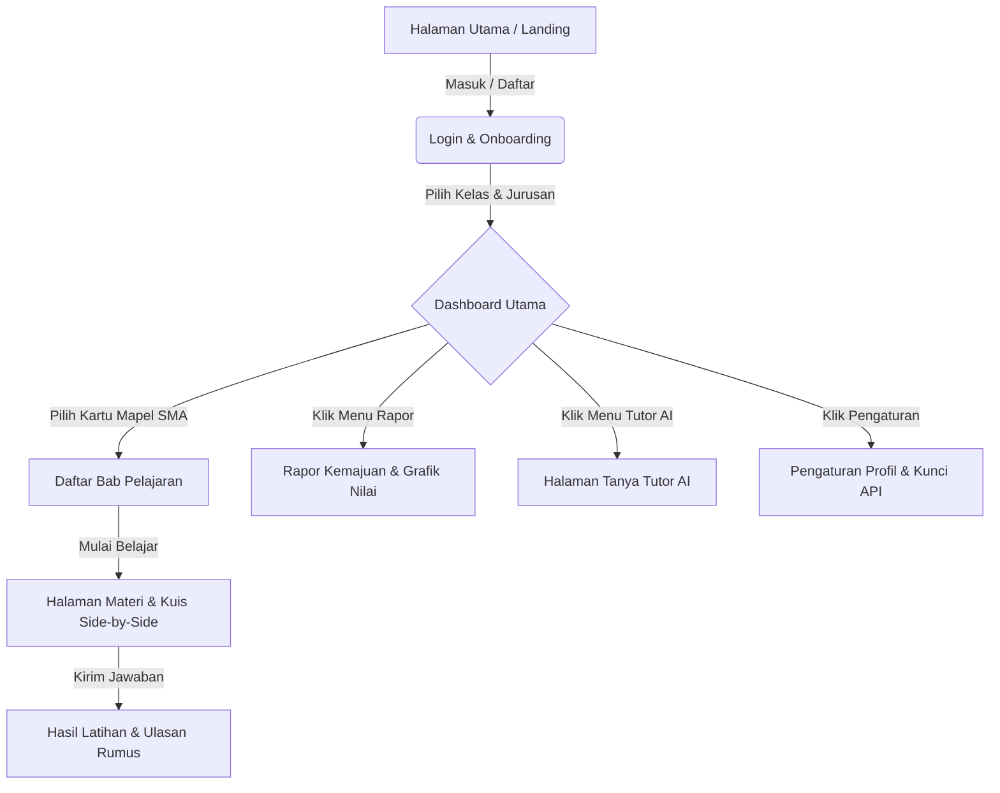

<h1 align="center">Pijar</h1>

<p align="center">
  <strong>Pijar — Pembelajaran Interaktif Pelajar (Versi SMA)</strong><br />
  Aplikasi pembelajaran sekolah interaktif berbasis gamifikasi yang dirancang untuk siswa SMA, memadukan materi teori visual dengan kuis split-screen, asisten Tutor AI, dan rapor kemajuan persiapan ujian.
</p>

<p align="center">
  <a href="#tentang-pijar">Tentang Pijar</a> ·
  <a href="#struktur-navigasi">Struktur Navigasi</a> ·
  <a href="#fitur-utama">Fitur Utama</a> ·
  <a href="#mata-pelajaran">Mata Pelajaran</a> ·
  <a href="#panduan-instalasi">Instalasi</a> ·
  <a href="#lisensi">Lisensi</a>
</p>

---

## Tentang Pijar

**Pijar** adalah platform pembelajaran interaktif sumber terbuka (*open-source*) yang dirancang khusus untuk siswa Sekolah Menengah Atas (SMA) usia 15-18 tahun sebagai bagian dari tugas mata kuliah Interaksi Manusia dan Komputer (IMK). Aplikasi ini mengadopsi prinsip kebergunaan (*Usability*) IMK secara menyeluruh melalui gaya antarmuka **Clay-Inspired UI** yang empuk, menyenangkan, dan tumpul guna membantu meredakan tingkat kecemasan belajar siswa SMA menjelang ujian sekolah dan UTBK/SNBT.

Proyek ini dibangun menggunakan arsitektur **Turborepo monorepo** dengan manajer paket **Bun**. Frontend aplikasi menggunakan **React 19 + TanStack Router + Tailwind CSS 4**, sedangkan backend ditenagai oleh **Hono + tRPC** dengan database **PostgreSQL** (melalui Drizzle ORM) dan sistem autentikasi **Better Auth**.

---

## Struktur Navigasi (Bab 3.3)

Untuk memudahkan penulisan Bab 3.3 (Struktur Navigasi) pada Laporan Proposal IMK Anda, berikut adalah peta alur navigasi langkah-demi-langkah (Sitemap) dari aplikasi Pijar versi SMA:



### Penjelasan Alur Navigasi:

1. **Halaman Landing / Utama (`/`)**:
   - Menampilkan sapaan motivasi ujian, informasi singkat aplikasi Pijar SMA, dan tombol "Mulai Belajar Sekarang". Mengarahkan siswa untuk melakukan login.

2. **Login & Onboarding Sederhana (`/login` & `/setup-avatar`)**:
   - Siswa mengisi nama panggilan, memilih ikon avatar kartun remaja, serta memilih jenjang kelas (Kelas 10, 11, atau 12 SMA) beserta rumpun jurusan (IPA/IPS).

3. **Dashboard / Beranda Utama (`/dashboard`)**:
   - Pusat navigasi siswa SMA yang berisi sapaan maskot pemberi motivasi, jumlah total Bintang dan XP kelulusan, serta kartu-kartu mata pelajaran utama SMA:
     - Matematika
     - Fisika
     - Kimia
     - Biologi
     - Bahasa Inggris

4. **Daftar Bab Pelajaran (`/packages`)**:
   - Menampilkan daftar bab pembelajaran dari mata pelajaran SMA yang dipilih (misal: "Fisika - Kinematika Gerak"). Dilengkapi dengan *progress bar* ketuntasan bab tersebut.

5. **Halaman Pembelajaran Side-by-Side (`/package/$id/take`)**:
   - **Sisi Kiri**: Kolom modul materi yang berisi teks ringkasan, rumus inti, diagram gaya, atau visualisasi eksperimen.
   - **Sisi Kanan**: Kolom kuis latihan soal berupa pilihan ganda (opsi A s.d. E) atau kuis analisis konsep.

6. **Rapor Kemajuan Siswa (`/analytics`)**:
   - Visualisasi tingkat kesiapan ujian berupa grafik radar mata pelajaran, status bintang emas latihan, progress bar linear penyelesaian materi, serta kartu rekomendasi AI Tutor untuk mengulang materi yang masih lemah.

7. **Tanya Tutor AI (`/generate`)**:
   - Halaman obrolan dengan asisten belajar cerdas di mana siswa dapat mengetik pertanyaan rumit atau memilih tombol pintasan cepat (seperti meminta latihan Kalkulus atau penjelasan hukum Fisika).

8. **Pengaturan (`/settings`)**:
   - Halaman untuk menyetel profil pribadi, mengganti avatar, serta memasukkan API Key OpenAI-compatible secara aman untuk penggunaan mandiri AI Tutor.

---

## Fitur Utama

- **Antarmuka Split-Screen (Side-by-Side)**: Menyajikan materi rumus di kiri dan kuis latihan di kanan dalam satu layar untuk memangkas pemborosan navigasi scroll (**Efficiency**).
- **Asisten Tutor AI Cerdas**: Chatbot asisten belajar SMA yang siaga memecahkan dan menerangkan rumus sains dan pemahaman bahasa secara logis dan terstruktur.
- **Rapor Visual Tergamifikasi**: Statistik kemajuan berupa bintang emas, akumulasi XP, dan grafik radar/batang nilai mapel untuk meningkatkan aspek **Satisfaction**.
- **Desain Clay Modern**: Sudut membulat tebal, warna kontras swatches, font rounded Quicksand & Nunito (membantu kenyamanan membaca lama - **Learnability**), dan efek hover taktil tebal (mendukung **Error Prevention**).
- **PWA (Progressive Web App)**: Aplikasi ringan yang dapat dipasang di smartphone Android/iOS atau laptop siswa dengan dukungan luring ringan.
- **Onboarding Cepat**: Pengisian data jenjang kelas SMA dan jurusan berbasis gambar kartu yang mudah digunakan.

---

## Mata Pelajaran

| Mata Pelajaran | Deskripsi Materi | Pendekatan Kuis |
|---|---|---|
| **Matematika** | Trigonometri, Aljabar, Eksponen, Barisan, Geometri Lingkaran, Matriks, Limit & Turunan, Integral, Statistika & Peluang | Kuis hitungan aljabar & pilihan ganda |
| **Fisika** | Kinematika, Hukum Newton, Usaha & Energi, Momentum, Dinamika Rotasi, Fluida, Termodinamika, Listrik Statis/Dinamis, Magnet, Fisika Modern | Analisis diagram gaya & pilihan ganda |
| **Kimia** | Struktur Atom, Ikatan Kimia, Stoikiometri, Termokimia, Laju Reaksi, Kesetimbangan, Asam-Basa, Penyangga, Koloid, Redoks, Elektrokimia, Senyawa Karbon | Penyetaraan reaksi & kuis mencocokkan rumus |
| **Biologi** | Struktur Sel & Transpor Membran, Jaringan Hewan & Tumbuhan, Fisiologi Organ Manusia, Metabolisme & Enzim, Genetika, Pembelahan Sel, Pewarisan Sifat, Evolusi, Bioteknologi | Diagram organel sel & pilihan ganda |
| **Bahasa Inggris** | Descriptive, Recount, Narrative, Procedure, Analytical Exposition, Report, Explanation, Discussion, formal invitation, causative verbs, reported speech | Pemahaman bacaan side-by-side & cloze test |

---

## Tech Stack

| Layer | Teknologi |
|---|---|
| Runtimes & Package Manager | [Bun](https://bun.sh) 1.3+ |
| Frontend Framework | React 19, Vite, [TanStack Router](https://tanstack.com/router) |
| Backend Server | [Hono](https://hono.dev), [tRPC](https://trpc.io) |
| ORM & Database | PostgreSQL + [Drizzle ORM](https://orm.drizzle.team) |
| Background Job / Antrean | Redis + BullMQ (Untuk antrean pembuatan kuis AI) |
| Autentikasi | [Better Auth](https://www.better-auth.com) |
| UI Library (Clay Style) | [shadcn/ui](https://ui.shadcn.com) di `packages/ui` |
| AI Integration | OpenAI-compatible API (`packages/ai`) |

---

## Panduan Instalasi

### 1. Klon Repositori dan Instal Dependensi

```bash
git clone https://github.com/rogasper/labas-bahasa.git Pijar
cd Pijar
bun install
```

### 2. Jalankan PostgreSQL dan Redis
Pastikan PostgreSQL dan Redis Anda sudah aktif. Proyek ini menyertakan Docker Compose untuk kemudahan lokal:

```bash
bun run db:start
```

### 3. Konfigurasi Variabel Lingkungan (.env)
Salin contoh file konfigurasi di bawah ini:

```bash
cp apps/server/.env.example apps/server/.env
cp apps/web/.env.example apps/web/.env
```

Sesuaikan nilai di dalam `apps/server/.env` terutama `DATABASE_URL`, `REDIS_URL`, dan `BETTER_AUTH_SECRET`.

### 4. Sinkronisasi Database
Jalankan migrasi database Drizzle untuk membuat tabel:

```bash
bun run db:push
```

Jalankan perintah seed untuk mengisi mata pelajaran SMA:

```bash
bun run db:seed
```

### 5. Jalankan Server Pengembangan

```bash
bun run dev
```

Aplikasi web dapat diakses di `http://localhost:3001` dan API server berjalan di `http://localhost:3000`.

---

## Kontribusi

Proyek ini sangat terbuka untuk dikembangkan lebih lanjut! Jika Anda ingin memodifikasi atau berkontribusi pada pengembangan Pijar:
1. Baca [AGENTS.md](./AGENTS.md) sebagai panduan struktur monorepo.
2. Jalankan `bun run check-types` untuk memastikan tidak ada kesalahan tipe data TypeScript.
3. Jalankan pengujian unit dengan `bun test`.

---

## Lisensi

Proyek ini dilisensikan di bawah **GNU Affero General Public License v3.0 (AGPL-3.0)**.
<br />
<p align="center">
  Dibuat dengan penuh rasa gembira oleh Tim Pijar untuk Masa Depan Pendidikan Pelajar Indonesia.
</p>
